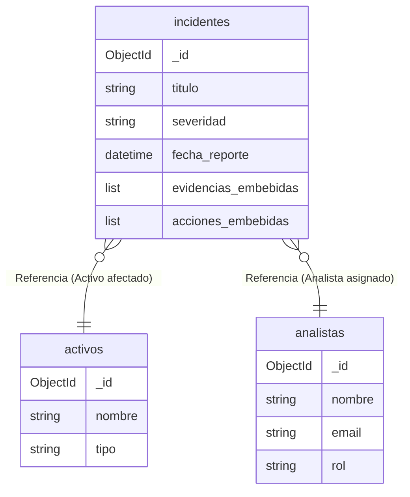

# Unidad 4: Bases de Datos No Estructuradas (TI3032)

**Integrantes:** Maria Jesus Perez
**Docente:** Mario Yáñez Urrutia
**Sección:** D-IINF-N3-P2-C2(F)/D

---

## 1. Descripción del Módulo Básico

Este repositorio contiene el Módulo de Software Básico y el script de diseño de base de datos para la solución **Security Incident Tracker**.

El módulo fue desarrollado en **Django 6.0.6** utilizando **MongoDB** como motor de base de datos documental, y **MongoEngine** como Object-Document Mapper (ODM). El sistema implementa un CRUD básico que demuestra la viabilidad técnica para gestionar activos, analistas e incidentes de seguridad, junto con sus respectivas evidencias embebidas.

---

## 2. Justificación del Modelo de Datos

Para definir la estructura de la base de datos se aplicó la **metodología de las 4 preguntas** (Independencia, Volumen, Consulta, Reutilización), obteniendo el siguiente diseño:

### 2.1 Entidades modeladas como **Colecciones**

1. **`analistas`**:
   - **Independencia:** Sí. Existen en la organización independientemente de si hay incidentes o no.
   - **Volumen:** Bajo/Medio (equipo de consultores).
   - **Consulta:** Se listan independientemente para asignar responsables.
   - **Reutilización:** Alta. Un analista se relaciona con cientos de incidentes y acciones distintas.

2. **`activos`**:
   - **Independencia:** Sí. Forman parte del inventario permanente del cliente.
   - **Volumen:** Medio (crece con el parque informático del cliente).
   - **Consulta:** Se busca y lista independientemente en inventarios.
   - **Reutilización:** Alta. Un activo puede sufrir múltiples incidentes a lo largo del tiempo.

3. **`incidentes`**:
   - **Independencia:** Sí. Es el documento central y transaccional del negocio.
   - **Volumen:** Alto (crece constantemente).
   - **Consulta:** Se listan en el dashboard principal (filtrados por fecha o severidad).
   - **Reutilización:** Actúa como contenedor principal.

### 2.2 Entidades modeladas como **Subdocumentos Embebidos**

1. **`evidencias`**, **`acciones`** y **`reportes`** (dentro de `incidentes`):
   - **Independencia:** Baja. Una evidencia o una acción de mitigación no tiene sentido ni valor de negocio si no está asociada al incidente que la originó.
   - **Volumen:** Acotado. Un incidente tiene un número limitado de evidencias o acciones (array finito, sin riesgo de superar los 16MB por documento).
   - **Consulta:** Siempre se leen en conjunto con el incidente. Al abrir el detalle del incidente, se requiere ver qué pasó (acciones) y qué pruebas hay (evidencias). Embeber evita costosos `$lookup` (JOINs).
   - **Reutilización:** Nula. Una captura forense específica o un reporte de cierre pertenece *única y exclusivamente* a ese incidente.

---

## 3. Estructura y Esquemas de Base de Datos

El diseño con validaciones `$jsonSchema` se encuentra en el archivo:
📄 [`script_mongodb.js`](script_mongodb.js)

### Índices Justificados:
- `analistas` (`{ email: 1 }`): Único, garantiza integridad y agiliza login/búsquedas de usuarios.
- `activos` (`{ tipo: 1 }`): Optimiza filtros estadísticos del inventario.
- `incidentes` (`{ fecha_reporte: -1 }`): Crítico para el rendimiento del dashboard, que por defecto siempre lista los incidentes más recientes primero.

### Diagrama de Relaciones Lógico



---

## 4. Instrucciones

Para ejecutar el módulo localmente, siga estos pasos:

### 4.1 Prerrequisitos
- Python 3.12+
- MongoDB Community Server (o contenedor Docker) ejecutándose en `localhost:27017` sin autenticación obligatoria.

### 4.2 Configuración del Entorno
1. Clonar o descomprimir el proyecto.
2. Crear y activar un entorno virtual:
   ```bash
   python -m venv .venv
   source .venv/bin/activate  # En Linux/Mac
   .venv\Scripts\activate     # En Windows
   ```
3. Instalar dependencias:
   ```bash
   pip install -r requirements.txt
   ```

### 4.3 Creación de Colecciones y Poblado de Datos

El proceso consta de dos pasos: primero crear las estructuras con sus reglas, y luego insertar datos de prueba.

**Paso 1: Crear Esquemas e Índices**
Ejecute el script `script_mongodb.js` en su motor de base de datos para crear las colecciones con validación `$jsonSchema` e índices. Puede hacerlo a través de MongoDB Shell (`mongosh`) desde la raíz del proyecto:
```bash
mongosh < script_mongodb.js
```
*(Opcionalmente, puede copiar y pegar el contenido del script directamente en MongoDB Compass).*

**Paso 2: Poblar Datos de Prueba (Django / MongoEngine)**
Una vez creadas las estructuras, ejecute el script en Python que demuestra las operaciones **Create** insertando entidades (Analistas, Activos e Incidentes) de prueba:
```bash
python poblar_incidentes.py
```
*Si se ejecuta correctamente, verá por consola la confirmación de la creación de los registros en MongoDB.*

### 4.4 Ejecución de la Aplicación Web (Read)
Para visualizar las operaciones **Read** implementadas en el módulo Django:
1. Inicie el servidor de desarrollo:
   ```bash
   python manage.py runserver
   ```
2. Abra su navegador e ingrese a la ruta configurada (generalmente `http://127.0.0.1:8000/` o la ruta de incidentes correspondiente).

---

## 5. Evidencias de Ejecución

> **Importante:** Se adjuntarán capturas de pantalla o un video en este archivo `.zip` (o se pueden insertar las imágenes en la carpeta raíz) demostrando la inserción de datos (`poblar_incidentes.py`) y la visualización de los datos (Read) en el navegador.

* [Insertar captura demostrando la inserción de datos en la terminal o Compass]
* [Insertar captura demostrando la visualización de incidentes en la interfaz web de Django]
