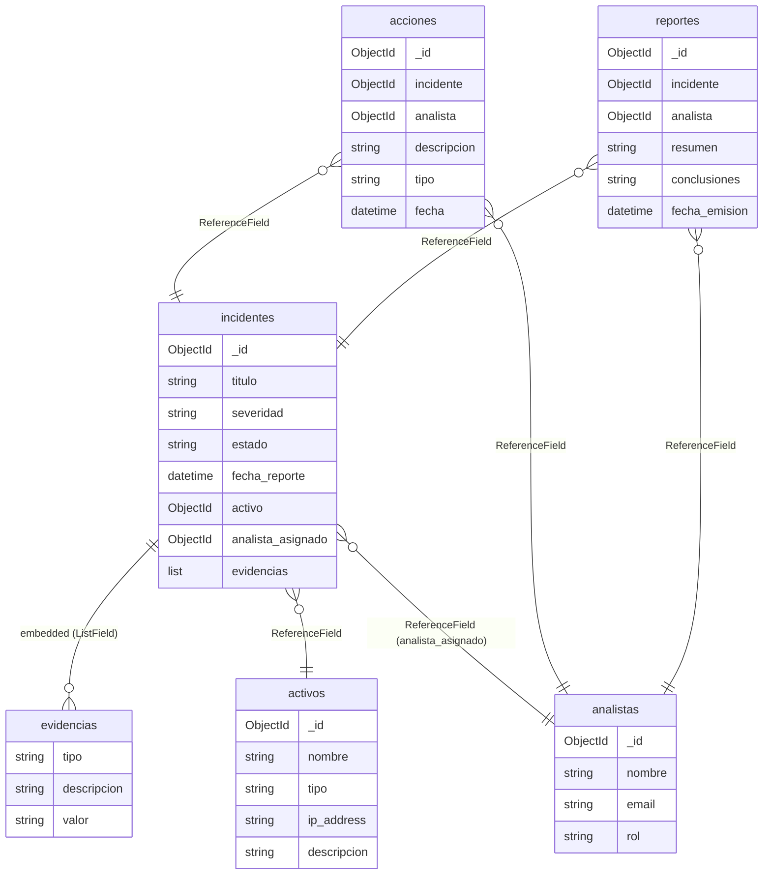

# Incident Tracker

**Proyecto:** Security Incident Tracker  
**Tecnologías:** Django 6.0.6 · MongoEngine 0.29.3 · MongoDB  

---

## 1. Descripción General

Sistema de registro y seguimiento de incidentes de seguridad informática. Permite registrar activos afectados, asignar analistas, documentar evidencias y acciones de mitigación, y emitir reportes de cierre.

---

## 2. Requerimientos Funcionales

### 2.1 Analistas

- RF01: Registrar un analista con nombre, email y rol.
- RF02: Listar todos los analistas registrados.

### 2.2 Activos

- RF03: Registrar un activo (sistema o dispositivo afectado) con nombre, tipo, dirección IP y descripción.
- RF04: Listar todos los activos registrados.

### 2.3 Incidentes

- RF05: Crear un incidente asociado a un activo y un analista responsable.
- RF06: Agregar evidencias a un incidente (almacenadas como documentos embebidos).
- RF07: Listar incidentes con posibilidad de filtrar por severidad o estado.
- RF08: Ver el detalle de un incidente, incluyendo sus evidencias embebidas.

### 2.4 Acciones

- RF09: Registrar una acción tomada sobre un incidente, indicando tipo y analista responsable.
- RF10: Listar las acciones asociadas a un incidente específico.

### 2.5 Reportes

- RF11: Generar un reporte de cierre para un incidente cerrado.
- RF12: Consultar el reporte asociado a un incidente.

---

## 3. Requerimientos No Funcionales

- RNF01: La base de datos debe ser MongoDB, ejecutándose localmente.
- RNF02: El acceso a la base de datos debe realizarse exclusivamente a través de MongoEngine como ODM.
- RNF03: El framework backend debe ser Django 6.0.6.
- RNF04: Las vistas serán function-based views con templates HTML simples.
- RNF05: No se requiere sistema de autenticación.
- RNF06: El proyecto debe incluir un script de datos de prueba ejecutable desde la shell de Django.

---

## 4. Schema de Base de Datos

### 4.1 Colección `analistas`

|   Campo  | Tipo     | Restricciones                          |
|----------|----------|----------------------------------------|
| `_id`    | ObjectId | Generado automáticamente               |
| `nombre` | String   | Requerido                              |
| `email`  | String   | Requerido                              |
| `rol`    | String   | Choices: `junior`, `senior`, `lead`    |

```python
class Analista(Document):
    nombre = StringField(required=True)
    email  = EmailField(required=True)
    rol    = StringField(choices=["junior", "senior", "lead"])

    meta = {"collection": "analistas"}
```

---

### 4.2 Colección `activos`

| Campo         | Tipo     | Restricciones                                    |
|---------------|----------|--------------------------------------------------|
| `_id`         | ObjectId | Generado automáticamente                         |
| `nombre`      | String   | Requerido                                        |
| `tipo`        | String   | Choices: `servidor`, `endpoint`, `red`           |
| `ip_address`  | String   | Opcional                                         |
| `descripcion` | String   | Opcional                                         |

```python
class Activo(Document):
    nombre      = StringField(required=True)
    tipo        = StringField(choices=["servidor", "endpoint", "red"])
    ip_address  = StringField()
    descripcion = StringField()

    meta = {"collection": "activos"}
```

---

### 4.3 EmbeddedDocument `evidencias` (embebido en `incidentes`)

> No es una colección independiente. Se almacena como lista dentro de cada documento `incidente`.

| Campo         | Tipo   | Restricciones                          |
|---------------|--------|----------------------------------------|
| `tipo`        | String | Choices: `log`, `hash`, `captura`      |
| `descripcion` | String | Requerido                              |
| `valor`       | String | El contenido de la evidencia           |

```python
class Evidencia(EmbeddedDocument):
    tipo        = StringField(choices=["log", "hash", "captura"])
    descripcion = StringField(required=True)
    valor       = StringField()
```

---

### 4.4 Colección `incidentes`

| Campo               | Tipo             | Restricciones                                              |
|---------------------|------------------|------------------------------------------------------------|
| `_id`               | ObjectId         | Generado automáticamente                                   |
| `titulo`            | String           | Requerido                                                  |
| `severidad`         | String           | Choices: `baja`, `media`, `alta`, `critica`                |
| `estado`            | String           | Choices: `abierto`, `en_investigacion`, `cerrado`          |
| `fecha_reporte`     | DateTime         | Default: fecha actual                                      |
| `activo`            | ReferenceField   | Referencia a `activos`                                     |
| `analista_asignado` | ReferenceField   | Referencia a `analistas`                                   |
| `evidencias`        | ListField        | Lista de `Evidencia` (EmbeddedDocument)                    |

```python
class Incidente(Document):
    titulo            = StringField(required=True)
    severidad         = StringField(choices=["baja", "media", "alta", "critica"])
    estado            = StringField(choices=["abierto", "en_investigacion", "cerrado"])
    fecha_reporte     = DateTimeField(default=datetime.utcnow)
    activo            = ReferenceField(Activo)
    analista_asignado = ReferenceField(Analista)
    evidencias        = ListField(EmbeddedDocumentField(Evidencia))

    meta = {"collection": "incidentes"}
```

---

### 4.5 Colección `acciones`

| Campo         | Tipo           | Restricciones                                        |
|---------------|----------------|------------------------------------------------------|
| `_id`         | ObjectId       | Generado automáticamente                             |
| `incidente`   | ReferenceField | Referencia a `incidentes`, requerido                 |
| `analista`    | ReferenceField | Referencia a `analistas`                             |
| `descripcion` | String         | Requerido                                            |
| `tipo`        | String         | Choices: `mitigacion`, `analisis`, `escalamiento`    |
| `fecha`       | DateTime       | Default: fecha actual                                |

```python
class Accion(Document):
    incidente   = ReferenceField(Incidente, required=True)
    analista    = ReferenceField(Analista)
    descripcion = StringField(required=True)
    tipo        = StringField(choices=["mitigacion", "analisis", "escalamiento"])
    fecha       = DateTimeField(default=datetime.utcnow)

    meta = {"collection": "acciones"}
```

---

### 4.6 Colección `reportes`

| Campo          | Tipo           | Restricciones                        |
|----------------|----------------|--------------------------------------|
| `_id`          | ObjectId       | Generado automáticamente             |
| `incidente`    | ReferenceField | Referencia a `incidentes`, requerido |
| `analista`     | ReferenceField | Referencia a `analistas`             |
| `resumen`      | String         | Requerido                            |
| `conclusiones` | String         | Opcional                             |
| `fecha_emision`| DateTime       | Default: fecha actual                |

```python
class Reporte(Document):
    incidente    = ReferenceField(Incidente, required=True)
    analista     = ReferenceField(Analista)
    resumen      = StringField(required=True)
    conclusiones = StringField()
    fecha_emision = DateTimeField(default=datetime.utcnow)

    meta = {"collection": "reportes"}
```

---

## 5. Diagrama de Relaciones



---

## 6. Features MongoEngine demostradas

| Feature                     | Dónde se usa                              |
|-----------------------------|-------------------------------------------|
| `Document`                  | Todas las colecciones principales         |
| `EmbeddedDocument`          | `Evidencia` dentro de `Incidente`         |
| `ReferenceField`            | Relaciones entre colecciones              |
| `ListField`                 | `evidencias` en `Incidente`               |
| `choices` en `StringField`  | Roles, severidades, estados, tipos        |
| `DateTimeField` con default | `fecha_reporte`, `fecha`, `fecha_emision` |

## 7. Comandos para ejecutar el proyecto

```bash
python –m venv .venv
(Set-ExecutionPolicy -Scope Process -ExecutionPolicy RemoteSigned) ; (& \.venv\Scripts\Activate.ps1)
pip install django
python.exe -m pip install --upgrade pip
New-Item requirements.txt
pip freeze > requirements.txt
django-admin startproject conf .
mkdir apps
cd apps
django-admin startapp incidentes
mkdir static
mkdir templates
cd templates
New-Item base.html, detalle.html, crear.html, editar.html, eliminar.html, lista.html
cd ../static
mkdir css
cd css
New-Item custom.css
pip freeze > requirements.txt
net start MongoDB  
git add .
git commit -m "iniciar proyecto"
git branch -M main
git remote add origin <https://github.com/mjperez/ev4-ti3032.git>
git push -u origin main
```
